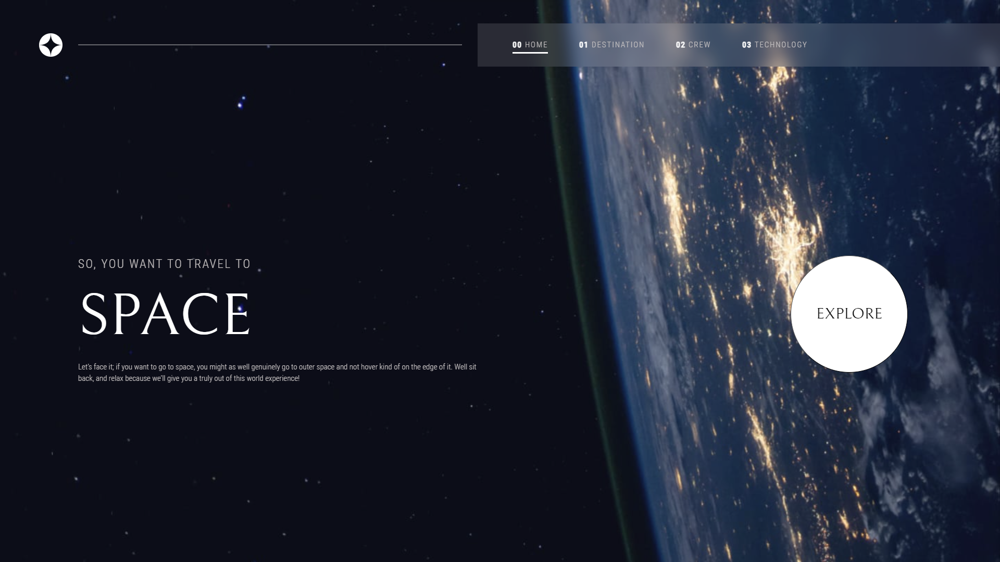

# Frontend Mentor - Space tourism website solution

This is a solution to the [Space tourism website challenge on Frontend Mentor](https://www.frontendmentor.io/challenges/space-tourism-multipage-website-gRWj1URZ3). Frontend Mentor challenges help you improve your coding skills by building realistic projects.

## Table of contents

- [Overview](#overview)
  - [The challenge](#the-challenge)
  - [Screenshot](#screenshot)
  - [Links](#links)
- [My process](#my-process)
  - [Built with](#built-with)
  - [What I learned](#what-i-learned)
  - [Continued development](#continued-development)
  - [Useful resources](#useful-resources)
- [Author](#author)
- [Acknowledgments](#acknowledgments)

**Note: Delete this note and update the table of contents based on what sections you keep.**

## Overview

### The challenge

- Design a website that introduce the space tourism service to users
  Users should be able to:

- View the optimal layout for each of the website's pages depending on their device's screen size
- See hover states for all interactive elements on the page
- View each page and be able to toggle between the tabs to see new information

### Screenshot



### Links

- Solution URL: [My link](https://github.com/RaidEyes/Space-tourism-challenge)
- Live Site URL: [](https://raideyes.github.io/Space-tourism-challenge/)

## My process

### Built with

- Semantic HTML5 markup
- CSS custom properties
- Flexbox
- CSS Grid
- Desktop-first workflow
- Vanilla Javascript

I built this project entirely from traditional coding, no frameworks and libraries were used. It was definitely tough when getting down to Javascript

### What I learned

Use this section to recap over some of your major learnings while working through this project. Writing these out and providing code samples of areas you want to highlight is a great way to reinforce your own knowledge.

To see how you can add code snippets, see below:

```js
chosenImg.addEventListener("transitionend", () => {
  chosenText.style.transition = "none";
  chosenImg.style.transition = "none";
});

menuButton.addEventListener("click", () => {
  navBar.classList.toggle("navigation-animation");
  navButton.forEach((item) => {
    item.dataset.open = item.dataset.open === "true" ? "false" : "true";
  });
});
```

The destination part and the Menu bar for mobile design got me weak.
For the destination transition, I used `transitionend` for `addEventListener`, it was not optimal. However, I would like to keep it because I figured it out by myself without any tutorials on the internet. For other people, that may be a `bug` or `mistake`. But for me, that was a lesson, an achievement.

Secondly, I got to learn about the `dataset.property` and how hard it was to use it. Thanks to Hyperplexed channel on Youtube, I was able to write the correct comparison statement.

### Continued development

This challenge took me more than 1 month to complete as I was studying extra hours on backend development.

### Useful resources

Like I said, I only used MDN and W3school to figured out the solution.
I recommend checking Hyperplexed on Youtube for his incredible frontend content.

## Author

- Frontend Mentor - [](https://www.frontendmentor.io/profile/RaidEyes)
